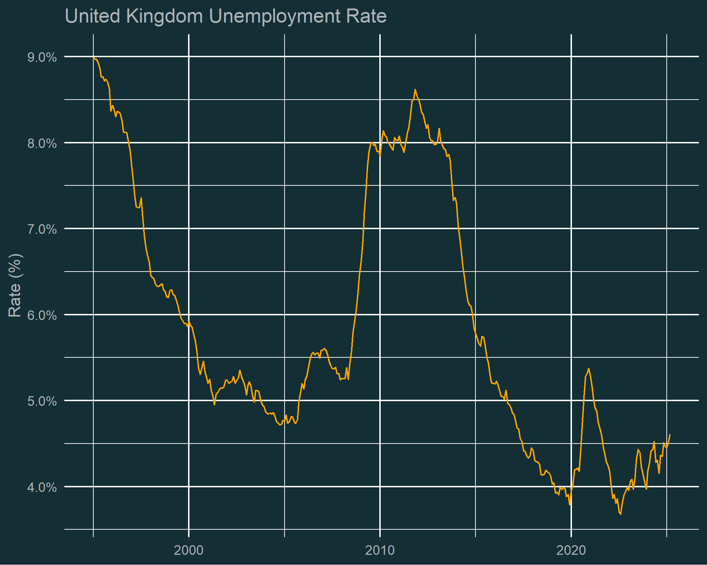
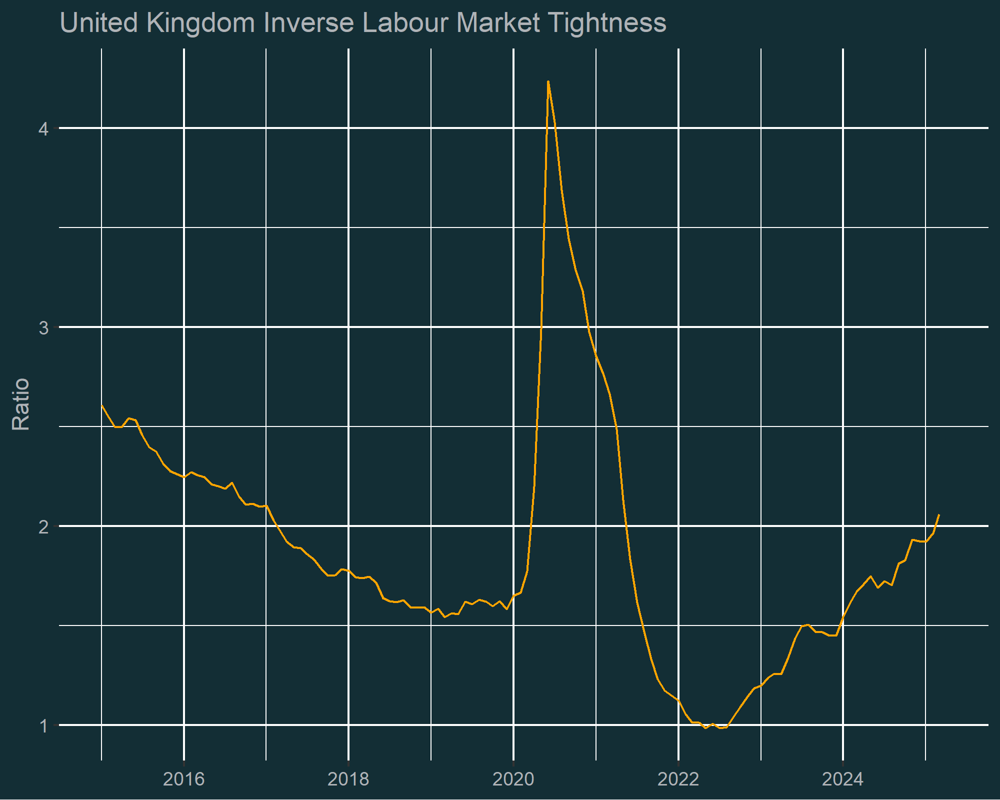
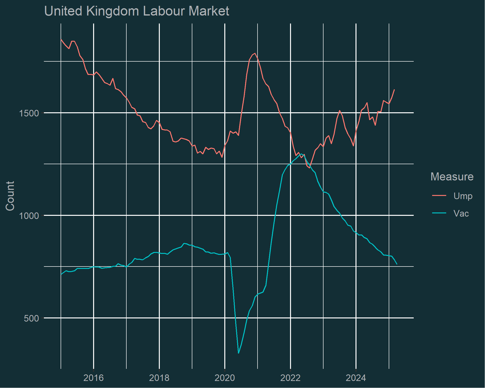

# United Kingdom Labour Market
A repository for my code that evaluates the UK  labour market tightness.

## UK Unemployment 
- number of unemployed individuals

## UK Inverse Labour Market Tightness
- number of unemployed individuals divided by the number of vacancies

## Components of the Labour Market Tightness Ratio
- vacancies and unemployment

